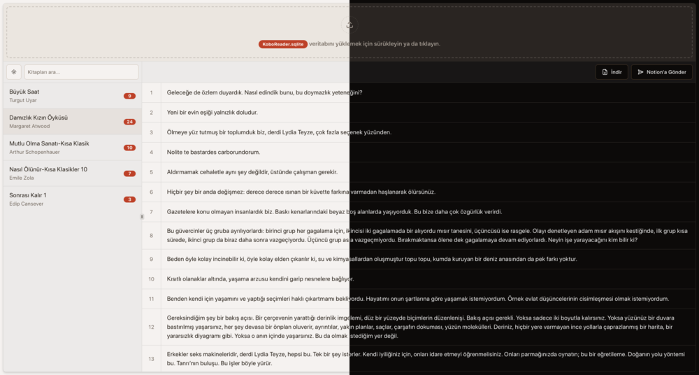

#  

KoboHighlights is a web application designed to extract and display highlights from the KoboReader.sqlite file and send them to Notion.



## :books: Table of Contents

- [:books: Table of Contents](#books-table-of-contents)
- [:book: Description](#book-description)
- [:sparkles: Features](#sparkles-features)
- [:gear: Installation](#gear-installation)
  - [:clipboard: Requirements](#clipboard-requirements)
  - [:hammer\_and\_wrench: Steps](#hammer_and_wrench-steps)
- [:rocket: Usage](#rocket-usage)
- [:whale: Docker Usage](#whale-docker-usage)
- [:cloud: Deploy on Vercel / Netlify](#cloud-deploy-on-vercel--netlify)
- [:crystal\_ball: Future Plans](#crystal_ball-future-plans)
- [:handshake: Contributing](#handshake-contributing)
- [:coffee: Supporting The Project](#coffee-supporting-the-project)
- [:scroll: License](#scroll-license)

## :book: Description

This project enables users to upload their KoboReader.sqlite file and view a list of books with highlights and the highlights themselves. Users can also send these highlights to Notion.

## :sparkles: Features

- Extract highlights from KoboReader.sqlite file
- Display highlights in a user-friendly interface
- Send highlights to Notion
- Save highlights to local storage for offline access
- Multi-language support (English and Turkish)
- Docker support for easy deployment
- Responsive UI

## :gear: Installation

To run the project locally, follow these steps:

### :clipboard: Requirements

- Node.js (>=14.x)
- pnpm package manager
- Docker (optional)

### :hammer_and_wrench: Steps

1. Clone the repository:

    ```sh
    git clone https://github.com/TaylanTatli/kobohighlights.git
    cd kobohighlights
    ```

2. Install dependencies:

    ```sh
    pnpm install
    ```

3. (Optional) Create a `.env` file in the root directory and add your environment variables:

    ```sh
    NEXT_PUBLIC_NOTION_PAGE_ID=your_notion_page_id
    NEXT_PUBLIC_NOTION_API_KEY=your_notion_api_key
    ```

    This is only necessary if you want to predefine your page ID and API key. If you don't create this file, you will need to enter your page ID and API key when you send highlights to Notion. These values will be saved to local storage for next time.

4. Start the development server:

    ```sh
    pnpm run dev
    ```

## :rocket: Usage

1. Open your browser and navigate to `http://localhost:3000`.
2. Upload your `KoboReader.sqlite` file.
3. View the list of books and their highlights.
4. Optionally, send highlights to Notion by entering your Notion Page ID and API Key, or download them to your PC.

## :whale: Docker Usage

To run the project using Docker, follow these steps:

1. Build the Docker image:

    ```sh
    docker build -t kobohighlights .
    ```

2. Start the Docker container:

    ```sh
    docker run -p 3000:3000 kobohighlights
    ```

3. Open your browser and navigate to `http://localhost:3000`.

## :cloud: Deploy on Vercel / Netlify

You can deploy this project to Vercel or Netlify by clicking the buttons below:

[](https://vercel.com/import/project?template=https://github.com/TaylanTatli/KoboHighlights)
[](https://app.netlify.com/start/deploy?repository=https://github.com/TaylanTatli/KoboHighlights)

## :crystal_ball: Future Plans

- Improve the user interface and user experience
- Add more export options (e.g., PDF)

## :handshake: Contributing

Contributions are welcome! Please open an issue or submit a pull request.

## :coffee: Supporting The Project

If you like the project and want to support me, You can <a href="https://www.buymeacoffee.com/taylantatli" target="_blank"></a>

## :scroll: License

This project is licensed under the MIT License. See the [LICENSE](LICENSE) file for details.
